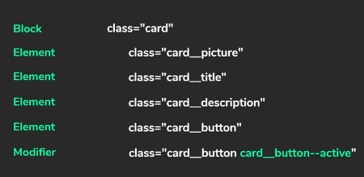

# HCUC Timetable 

This application is to help teachers of HCUC to manage student timetables easily.

---

>## **Note:**

  - ".js" files wont be parsed as JSX, so make sure to rename  JS files containing JSX syntax to end with ".jsx" instead of ".js".
  
  - For CSS class names, follow the "[BEM](http://getbem.com/naming/)" naming convention.
  Example;
  

  - To enforce linting the we use the "[Standard style guide](https://standardjs.com/)".


  - Use "`window.fetch()`" instead of "`fetch()`"
  ```js

    //Wrong 
    fetch('http://localhost:8000/list_of_software')
      .then(response => response.json())
      .then(data => SetListOfSoftware(data))
    
    //Correct
    window.fetch('http://localhost:8000/list_of_software')
      .then(response => response.json())
      .then(data => SetListOfSoftware(data))

  ```

---


> ## **Commands**

  - `npm start` — This will spawn a development server with a default port of `3000`.

  - `npm run build` — This will output a production build in the `dist` directory.

  - `npm run wbuild` — This will create a production build everytime a file is saved.
  
  - `npm run preview` — Runs server to view the production build of the application.

  - `npm run lint` — Checks for linting errors.
  
  - `npm run fix` — Fixes linting errors.
